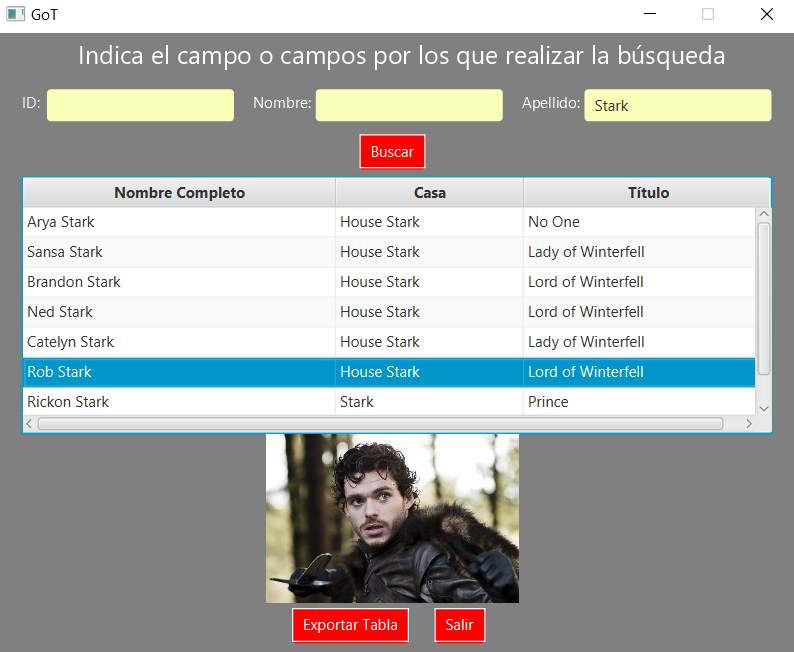

# Introducción

# Manual  técnico para desarrolladores

# Manual de usuario con juego de pruebas

Para comenzar a utilizar la aplicación se debe realizar un log in con uno de los usuarios válidos con su correspondiente contraseña.

En caso de que alguno de los dos campos sea incorrecto aparecerá un mensaje indicando que el nombre o la contraseña son incorrectos.

Una vez terminado el log in se accede a la pantalla de búsquedas donde se podrán realizar búsquedas de personaje por tres campos distintos: id, nombre y apellido.
En caso de que haya varios personajes que coincidan con la búsqueda realizada estos apareceran en una tabla.

Búsqueda por id:

Búsqueda por nombre:

Búsqueda por apellido:

Además también se podrá buscar por diferentes campos al mismo tiempo.

En caso de que ningún dato coincida con la búsqueda realizada la tabla aparecerá vacía.

Una vez realizada la búsqueda se podrán seleccionar los personajes de la tabla para que muestre una foto del personaje seleccionado.

Cuando se haya terminado la búsqueda se puede pulsar el botón *Exportar Tabla* para ir a la siguiente pantalla, donde se podrá elegir el nombre y tipo de documento al que se desea exportar entre los disponibles (.txt, .bin, .json, .xml).

En caso de que no se haya proporcionado un nombre de documento aparecerá un mensaje en pantalla indicándolo y no se realizará la exportación.

Cuando la exportación se realice correctamente aparecerá esta ventana emergente confirmando la exportación. Los documentos se guardarán en la carpeta *docs*.

Por último si se desea seguir realizando búsquedas se pulsará el botón *Volver* para ir a la pantalla de búsquedas.

# Reparto de tareas

# Extras realizados

# Propuestas de mejora

# Conclusiones
    
### Dedicación temporal

A este proyecto cada uno de los integrantes le ha dedicado un total de 20 horas divididos entre los distintos días de la semana de la siguiente manera.

### Cualificación estimada
